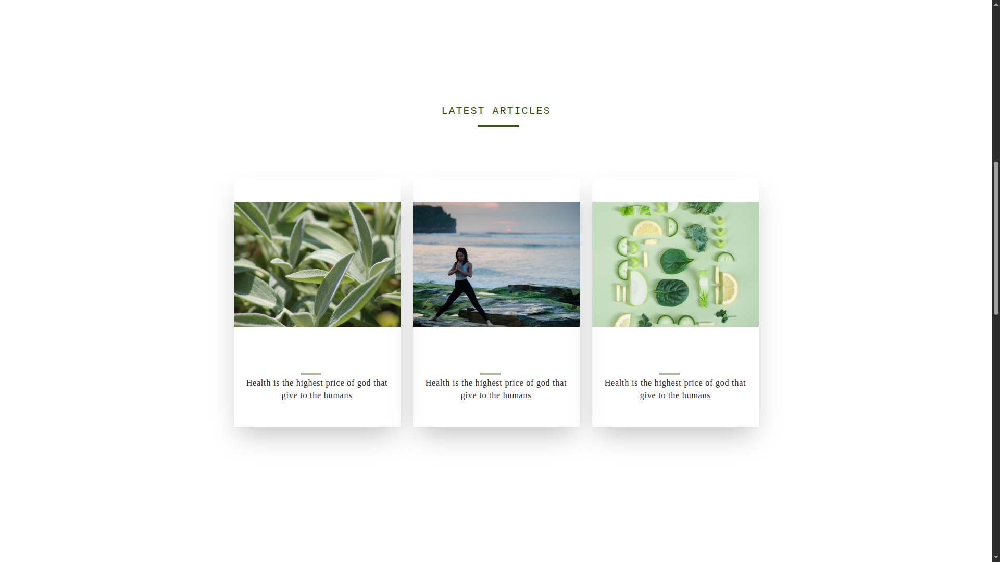
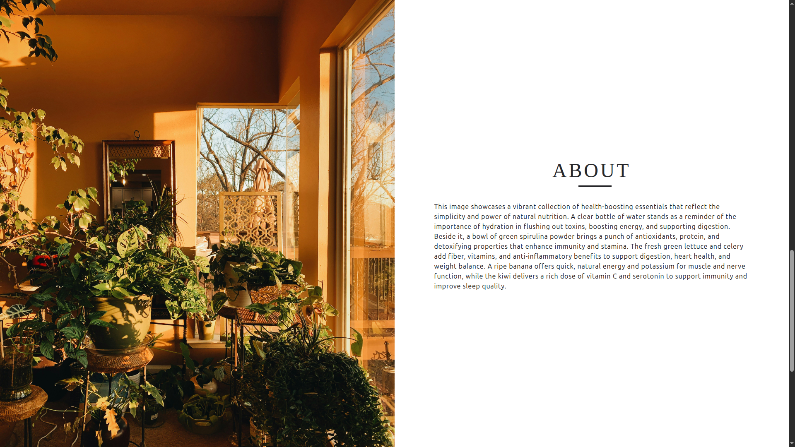
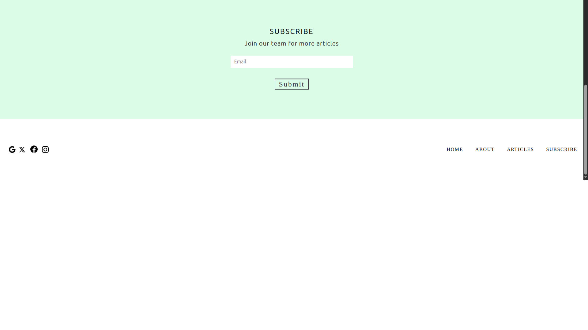

Tailwind Layout Template 🎨
A clean, modern, and fully responsive website template built with HTML and Tailwind CSS. Perfect for starting your next project quickly!
✨ Features

Fully Responsive - Works seamlessly on all devices
Modern Design - Clean and professional layout
Utility-First CSS - Built with Tailwind CSS for easy customization
Lightweight - No bloated frameworks, just pure HTML and CSS
Easy to Use - Simple structure, easy to understand and modify
Cross-Browser Compatible - Works on all modern browsers

🚀 Quick Start

Clone the repository
bashgit clone https://github.com/vikashraosahab/tailwind_layout.git
cd tailwind_layout

Open in your browser
bash# Simply open index.html in your browser
open index.html

Start customizing!

Edit the HTML files
Modify Tailwind classes to match your design
Add your own content

🛠️ Built With

HTML5 - Semantic markup
Tailwind CSS - Utility-first CSS framework
Responsive Design - Mobile-first approach

📁 Project Structure
tailwind_layout/
├── index.html          # Main landing page
├── css/
│   └── styles.css      # Custom styles (if any)
├── assets/
│   └── images/         # Image assets
└── README.md           # This file
🎯 Usage
This template is perfect for:

Landing pages
Portfolio websites
Business websites
Personal projects
Learning Tailwind CSS

🎨 Customization
The template uses Tailwind's utility classes, making it super easy to customize:

Colors: Change color classes like bg-blue-500 to bg-red-500
Spacing: Modify padding and margins with p-4, m-8, etc.
Typography: Update text sizes with text-lg, text-xl, etc.
Layout: Adjust with flexbox and grid utilities

🤝 Contributing
Contributions are welcome! Feel free to:

Report bugs
Suggest new features
Submit pull requests
Improve documentation

📝 License
This project is free and open source. You can use it for personal or commercial projects.
🙏 Support
If you found this template helpful, please consider:

⭐ Starring the repository
🐛 Reporting issues
🔄 Sharing with others

📧 Contact
Created by @vikashraosahab
E-mail : vikashvinayrao@gmail.com

Happy coding! 🚀